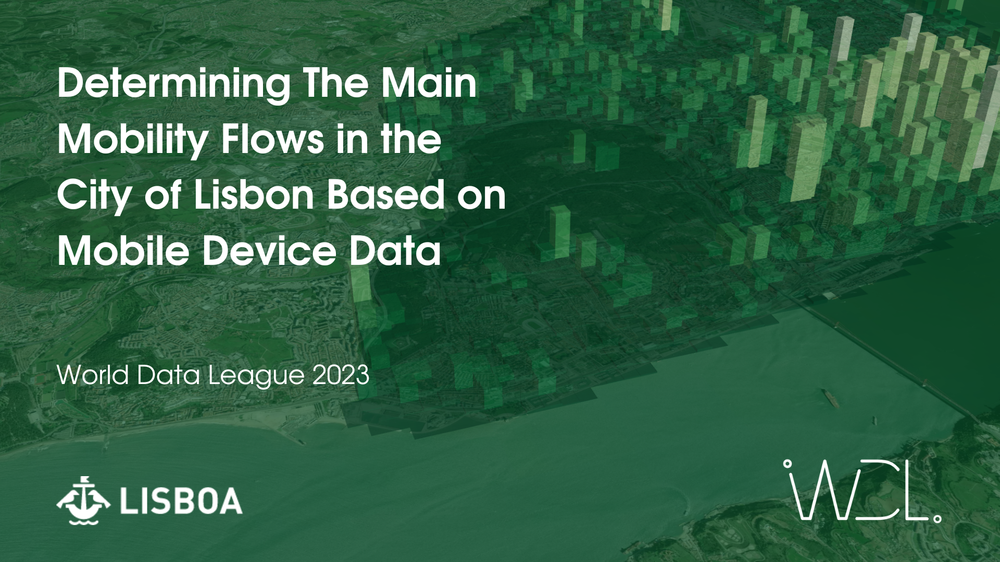

# wdl-2023
World Data League 2023 Challenge

World Data League is an international competition that gathers the best minds in the Data Science field to develop long-lasting solutions for social impact challenges.

## Challenges
STAGE 1 CHALLENGE:
* Determining The Main Mobility Flows in the City of Lisbon Based on Mobile Device Data

SEMI-FINALS CHALLENGE:
* Avencas Marine Protected Area: Predict the Future of the Local Ecosystem and its Species

FINALS CHALLENGE:
* Energy communities inclusive of residents vulnerable to energy poverty

https://www.worlddataleague.com/
